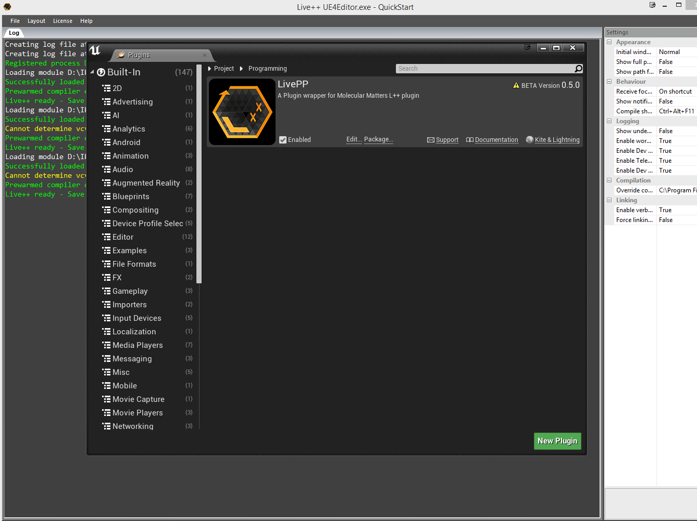

# UE4 LivePP: C/C++ live coding

A UE4 plugin wrapper for the amazing Molecular Matter's Live++ Hot-Reloading Library. (https://molecular-matters.com/products_livepp.html).
One day we will get sub-second iteration in Unreal Engine 4.



Live++ Documentation:
https://molecular-matters.com/docs/livepp/documentation.html

Status
------

UE4 Plugin Features:

- Slight validation for ensuring necessary Live++ flags are set (!Target.bAllowLTCG, !Target.bDisableDebugInfo, !Target.bOmitPCDebugInfoInDevelopment)
- Support for PrePatchHook/PostPatchHook through engine delegates.
- Support for syncing hotreload at engine's BeginFrame, EndFrame, or None (No syncing).
- Plugin loads in PostEngineInit(), loads Live++ as an external module, iterates over all loaded modules and registers the game modules.
- Plugin is disabled from running in commandlet mode.

Tested Configuration:
  - Live++ 1.2.5 - 1.3.0
  - UE 4.19 - 4.20
  - Win64
  - In UE4 Editor
  - Plugin as a game project plugin

Usage instructions

1. Enable VS required compilation flags:

	Live++ requires some additional compilation flags that Unreal doesn't have enabled out of the box.

	- The cl.exe flag: [`/Gw` (Optimize Global Data)](https://msdn.microsoft.com/en-us/library/dn305952.aspx?f=255&MSPPError=-2147217396)
	- The Linker flag: [`/FUNCTIONPADMIN` (Create Hotpatchable Image)](https://docs.microsoft.com/en-us/cpp/build/reference/functionpadmin-create-hotpatchable-image)

	There are a few approaches that you can take to enable these depending on which engine version you are on.

	A. 4.19+ Modify VCToolChain.cs:
	
	- You will manually have to rebuild the entire solution if you want to hotreload engine modules.
	- At the top of `VCToolChain::AppendCLArguments_CPP` add `Arguments.Add("/Gw");`
	- At the top of `VCToolChain::AppendLinkArguments` add `Arguments.Add("/FUNCTIONPADMIN");`

	B. 4.19 Extend UBT Target rules:
	
	- The following engine changes shipped in 4.20, but you can backport them to 4.19, and then use the 4.20+ instructions below.
	- Add the following to the `TargetRules.cs:TargetRules` class:
		```
		[RequiresUniqueBuildEnvironment]
		[XmlConfigFile(Category = "BuildConfiguration")]
		public string AdditionalCompilerArguments;
		[RequiresUniqueBuildEnvironment]
		[XmlConfigFile(Category = "BuildConfiguration")]
		public string AdditionalLinkerArguments;
		```
	- Add the following to the `ReadOnlyTargetRules` class:
		```
		public string AdditionalCompilerArguments
		{
			get { return Inner.AdditionalCompilerArguments; }
		}
		
		public string AdditionalLinkerArguments
		{
			get { return Inner.AdditionalLinkerArguments; }
		}
		```
	- Add the following to `UEBuildTarget.SetupGlobalEnvironment()`:
		```
		GlobalCompileEnvironment.AdditionalArguments = Rules.AdditionalCompilerArguments;
		GlobalLinkEnvironment.AdditionalArguments = Rules.AdditionalLinkerArguments;
		```
	- Follow the instructions below.

	C. 4.20+ Modify `Game.Target.cs`:

	- Add the following to your `Game.Target.cs` file:
		```
		AdditionalCompilerArguments = "/Gw";
		AdditionalLinkerArguments   = "/FUNCTIONPADMIN";
		```

	**NOTE:** UBT support for UniqueBuildEnvironment doesn't work well if your game is not in a subdirectory of the UnrealEngine (e.g. UE_4.XX/Games where UE_4.XX is your UnrealEngine root director that has UE_4.XX/Engine, UE_4.XX/FeaturePacks, etc").  Your best bet is to follow Option A even for 4.20+ and modify the buildconfiguration.xml(https://docs.unrealengine.com/en-US/Programming/UnrealBuildSystem/Configuration) file instead of `Game.Target.cs`:

	```
	<BuildConfiguration>
	<AdditionalCompilerArguments>/Gw</AdditionalCompilerArguments>
	<AdditionalLinkerArguments>/FUNCTIONPADMIN</AdditionalLinkerArguments>
	</BuildConfiguration>
	```

2. Clone this repo into your game or engine plugins directory (eg `\GameModule\Plugins\LivePP`)

3. Extract LPP.zip into this folder: `\Plugins\LivePP\Source\ThirdParty\LPPExternalLib`

	The result should look like the following:

	```
	\Plugins\LivePP\Source\ThirdParty\LPPExternalLib\LivePP
	\Plugins\LivePP\Source\ThirdParty\LPPExternalLib\LivePP\API\*
	\Plugins\LivePP\Source\ThirdParty\LPPExternalLib\LivePP\x64\*
	\Plugins\LivePP\Source\ThirdParty\LPPExternalLib\LivePP\x86\*
	```

	etc

4. Enable the LivePP plugin:

	- In your `Game.Build.cs` file add: `PrivateDependencyModuleNames.Add("LivePP");`
	- Build and launch the editor and navigate to the Project Settings, scroll down to Plugins -> LivePP and check the `Enable` box.

5. Optional suggestions:

	These are other settings that you can play with which may improve Live++ reloading times.

	A. Force off UnityBuilds (slower full recompilation but faster L++ hotreloading)
	
	- `bUseUnityBuild = false && bForceUnityBuild = false`

	B. Ensure adaptive unity builds are working (UBT uses git status or if it detects perforce, the file's readonly attribute
	to determine if a source file has been touched. If so, it will pull that file out of the unity build. So you just have to
	ensure to touch the file before you launch UE4 with L++

	- Settings to use: `bUseAdaptiveUnityBuild`, `bAdaptiveUnityDisablesPCH`, `MinGameModuleSourceFilesForUnityBuild`

	C. Force all game modules to not use unity builds.

	- `bFasterWithoutUnity = true`

	The best workflow I've found is use adaptive unity builds for the engine while forcing all game modules to not use unity builds.

Troubleshooting:
----------

Incredibuild
* Can't find compiler/must override cl/link.exe paths
	Incredibuild caches the compiler toolchain in a directory and then deletes it after a build so L++ won't be able to find it.
	You can manually override the toolchain paths: C:\Program Files (x86)\Microsoft Visual Studio\2017\Professional\VC\Tools\MSVC\14.13.26128\bin\Hostx64\x64\cl.exe && C:\Program Files (x86)\Microsoft Visual Studio\2017\Professional\VC\Tools\MSVC\14.13.26128\bin\Hostx64\x64\link.exe

	Watch out for UE4 using 2015 toolchain (default) even if you are generating VS2017 projects.
	Turned out that even though he had a VS 2017 project and toold VS/UE to use the VS 2017 toolchain, somehow UBT insisted on using VS 2015. The overridden paths would point to his VS 2017 cl.exe, so the compiler would complain about the PCH being from a previous version of the compiler
